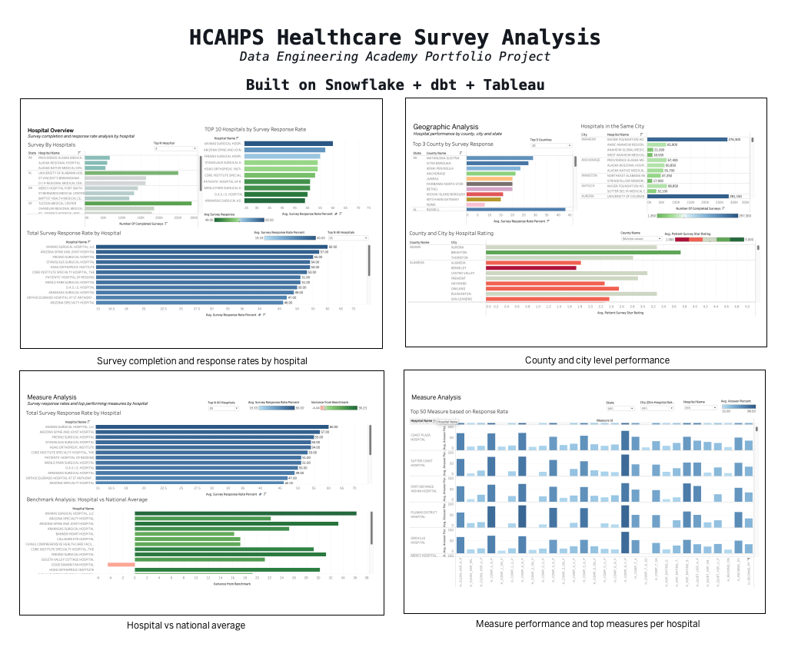

# HCAHPS Healthcare Data Warehouse

End-to-end healthcare data warehouse built on Snowflake and dbt. Loads CMS HCAHPS patient survey data into a star schema with four dimension tables and one fact table using a medallion architecture. Includes dbt tests for primary keys, referential integrity, and data quality across all layers.


---

## Architecture

```
CMS HCAHPS CSV (34,999 rows)
        |
        v
[ Snowflake Internal Stage ]
  HCAHPS_STAGE (GZIP compressed)
        |
        v
[ RAW Layer ]
  HEALTHCARE_ANALYSIS.RAW
  └── RAW_PATIENT_SURVEY
      23 columns, all VARCHAR, safe landing zone
        |
        v
[ SILVER Layer ] -- dbt views
  HEALTHCARE_ANALYSIS.STAGING_SILVER
  └── stg_patient_survey
      Cleaned, trimmed, TRY_CAST typed columns
        |
        v
[ GOLD Layer ] -- dbt tables
  HEALTHCARE_ANALYSIS.GOLD_MARTS
  ├── dim_country_details  (629 rows)
  ├── dim_hospital_details (700 rows)
  ├── dim_measure_details  (50 rows)
  ├── dim_survey_details   (50 rows)
  └── fact_patient_survey  (34,999 rows)
        |
        v
[ REPORTS Layer ] -- dbt tables
  HEALTHCARE_ANALYSIS.REPORTS
  ├── rpt_surveys_by_hospital
  ├── rpt_response_rate_by_measure
  ├── rpt_top_3_counties
  ├── rpt_top_10_hospitals
  ├── rpt_county_city_rating
  ├── rpt_hospitals_by_city
  ├── rpt_total_response_rate
  ├── rpt_hospital_vs_benchmark
  └── rpt_top3_measures_per_hospital
```

---

## Data Model

Star schema with four dimensions and one transactional fact table.

| Table | Type | Rows | Primary Key | Description |
|---|---|---|---|---|
| dim_country_details | Dimension | 629 | country_id | US geographic data: state, city, zip, county |
| dim_hospital_details | Dimension | 700 | hospital_id | Hospital details with country_id as FK |
| dim_measure_details | Dimension | 50 | measure_sk | Survey measure definitions and date ranges |
| dim_survey_details | Dimension | 50 | survey_id | Survey questions, answers, star rating footnotes |
| fact_patient_survey | Fact | 34,999 | - | All four FK references plus survey measures |

### Fact Table Foreign Keys

| FK Column | References |
|---|---|
| country_id | dim_country_details.country_id |
| hospital_id | dim_hospital_details.hospital_id |
| measure_sk | dim_measure_details.measure_sk |
| survey_id | dim_survey_details.survey_id |

---

## Tech Stack

| Tool | Purpose |
|---|---|
| Snowflake | Data warehouse, internal stage, COPY INTO |
| dbt Cloud | Transformations, tests, lineage, documentation |
| SQL | All transformation and report logic |
| CMS HCAHPS | Source dataset (public, Centers for Medicare and Medicaid Services) |
| GitHub | Version control and portfolio |

---

## dbt Layers

### Staging (SILVER, materialized as view)

Reads from `RAW_PATIENT_SURVEY` via a dbt source definition. Cleans and casts all 23 raw columns:

- String columns: `TRIM()` to remove whitespace
- Numeric columns: `TRY_CAST(... AS FLOAT)` for measures and percentages
- Integer columns: `TRY_CAST(... AS INT)` for footnote codes and survey counts
- Date columns: `TRY_CAST(... AS DATE)` for measure start and end dates

`TRY_CAST` is used throughout so suppressed CMS values return NULL instead of failing the load.

### Marts (GOLD, materialized as table)

Four dimension models built from staging using CTEs with `SELECT DISTINCT` for deduplication and `ROW_NUMBER()` for surrogate key generation.

`dim_hospital_details` joins to `dim_country_details` at build time to carry `country_id` as a foreign key, so the fact table only needs three joins instead of four to resolve all FKs.

`COALESCE` is used on join conditions involving `county_name` to handle NULL county values present in the CMS source data for certain states including Alaska.

### Reports (REPORTS, materialized as table)

Nine report models covering hospital performance, geographic analysis, measure benchmarking, and custom analytical insights. All reports ref the marts layer via `{{ ref() }}` so the lineage graph is fully connected.

---

## dbt Tests

Tests are defined in `schema.yml` files at both the marts and reports layers.

### Marts Tests

| Test | Column | Model |
|---|---|---|
| unique, not_null | country_id | dim_country_details |
| unique, not_null | hospital_id | dim_hospital_details |
| not_null, relationships | country_id | dim_hospital_details |
| unique, not_null | measure_sk | dim_measure_details |
| unique, not_null | survey_id | dim_survey_details |
| not_null, relationships | hospital_id | fact_patient_survey |
| not_null, relationships | country_id | fact_patient_survey |
| not_null, relationships | measure_sk | fact_patient_survey |
| not_null, relationships | survey_id | fact_patient_survey |

The `relationships` tests validate end-to-end referential integrity, confirming every FK in the fact table resolves to a valid PK in the corresponding dimension.

### Reports Tests

not_null tests on key columns across all nine report models. `accepted_values` test on `benchmark_status` in `rpt_hospital_vs_benchmark` confirming only `Above Benchmark` or `Below Benchmark` values are present.

### Known Data Quality Notes

- 4,050 rows have NULL `survey_response_rate_percent` due to CMS data suppression for low-volume hospitals. This is expected source behavior and is handled with `COALESCE(..., 0)` in report aggregations.
- Some hospitals in Alaska and other states have missing `county_name` in source data. Handled with `COALESCE(county_name, '')` on both sides of the dimension join condition.

---

## Reports

| Report Model | Description |
|---|---|
| rpt_surveys_by_hospital | Total completed surveys per hospital, ordered by volume |
| rpt_response_rate_by_measure | Average response rate per measure per hospital |
| rpt_top_3_counties | Top 3 counties by average survey response rate |
| rpt_top_10_hospitals | Top 10 hospitals by average survey response rate |
| rpt_county_city_rating | County and city drill-down with average hospital star ratings |
| rpt_hospitals_by_city | Cities with multiple hospitals, listing all hospitals per city |
| rpt_total_response_rate | Total survey response rate summed per hospital |
| rpt_hospital_vs_benchmark | Each hospital compared to national average per measure, flagged Above or Below Benchmark |
| rpt_top3_measures_per_hospital | Top 3 performing measures per hospital ranked by answer percent and star rating using window functions |

---

## How to Run

### Step 1: Load Raw Data into Snowflake

```sql
-- Create database and schema
CREATE DATABASE IF NOT EXISTS HEALTHCARE_ANALYSIS;
CREATE SCHEMA IF NOT EXISTS HEALTHCARE_ANALYSIS.RAW;

-- Create file format
CREATE OR REPLACE FILE FORMAT HCAHPS_CSV_FORMAT
  TYPE = 'CSV'
  FIELD_DELIMITER = ','
  RECORD_DELIMITER = '\r\n'
  SKIP_HEADER = 1
  FIELD_OPTIONALLY_ENCLOSED_BY = '"'
  TRIM_SPACE = TRUE
  NULL_IF = ('', 'NULL', 'Not Available')
  EMPTY_FIELD_AS_NULL = TRUE;

-- Create internal stage
CREATE OR REPLACE STAGE HCAHPS_STAGE
  FILE_FORMAT = HCAHPS_CSV_FORMAT;

-- Upload file from local machine (SnowSQL)
PUT 'file:///path/to/Health Care_Patient_survey_source.csv' @HCAHPS_STAGE AUTO_COMPRESS=TRUE;

-- Create raw landing table
CREATE OR REPLACE TABLE RAW_PATIENT_SURVEY (
  provider_id VARCHAR, hospital_name VARCHAR, address VARCHAR, city VARCHAR,
  state VARCHAR, zip_code VARCHAR, county_name VARCHAR, phone_number VARCHAR,
  measure_id VARCHAR, question VARCHAR, answer_description VARCHAR,
  patient_survey_star_rating VARCHAR, patient_survey_star_rating_footnote VARCHAR,
  answer_percent VARCHAR, answer_percent_footnote VARCHAR, linear_mean_value VARCHAR,
  number_of_completed_surveys VARCHAR, number_of_completed_surveys_footnote VARCHAR,
  survey_response_rate_percent VARCHAR, survey_response_rate_percent_footnote VARCHAR,
  measure_start_date VARCHAR, measure_end_date VARCHAR, location VARCHAR
);

-- Load data
COPY INTO RAW_PATIENT_SURVEY
  FROM @HCAHPS_STAGE
  FILE_FORMAT = HCAHPS_CSV_FORMAT
  ON_ERROR = 'CONTINUE';
```

### Step 2: Run dbt

```bash
# Run all models
dbt run

# Run tests
dbt test

# Run specific layer
dbt run --select staging
dbt run --select marts
dbt run --select reports
```

---

## Project Structure

```
hcahps-dbt-healthcare/
models/
  staging/
    sources.yml
    stg_patient_survey.sql
  marts/
    dim_country_details.sql
    dim_hospital_details.sql
    dim_measure_details.sql
    dim_survey_details.sql
    fact_patient_survey.sql
    schema.yml
  reports/
    rpt_surveys_by_hospital.sql
    rpt_response_rate_by_measure.sql
    rpt_top_3_counties.sql
    rpt_top_10_hospitals.sql
    rpt_county_city_rating.sql
    rpt_hospitals_by_city.sql
    rpt_total_response_rate.sql
    rpt_hospital_vs_benchmark.sql
    rpt_top3_measures_per_hospital.sql
    schema.yml
macros/
  generate_schema_name.sql
dbt_project.yml
README.md
```

---

## Key Design Decisions

**Why all VARCHAR in the raw landing table?**
Landing all columns as VARCHAR ensures the COPY INTO never fails on a type mismatch. Type casting happens in the staging layer where failures return NULL via TRY_CAST rather than erroring the entire model.

**Why is country_id carried on dim_hospital_details?**
The source data has no explicit country column. Country is derived from the geographic combination of state, city, zip, and county. Joining at the hospital dimension level means the fact table only needs three joins to resolve all four FKs, keeping the fact model cleaner and more efficient.

**Why LEFT JOIN in the fact table instead of INNER JOIN?**
LEFT JOIN ensures all 34,999 source rows are preserved even if a dimension join doesn't match. This makes NULL FK values visible and diagnosable rather than silently dropping rows.

---
## Tableau Dashboards
[View on Tableau Public](#) — link coming soon



Built a multi-dashboard Tableau workbook connected directly to the Snowflake star schema (GOLD_MARTS), allowing dynamic aggregations and interactive filtering across all visualizations.

### Dashboard Structure

| Dashboard | Description |
|---|---|
| Home | Landing page with navigation to all four dashboards |
| Hospital Overview | Survey completion and response rates by hospital |
| Geographic Analysis | County and city level performance across states |
| Measure Analysis | Response rate distribution and top measures per hospital |
| Benchmark Analysis | Hospital performance compared to national average |

### Key Visualizations

- Horizontal bar chart: Top N hospitals by completed surveys per state (dynamic parameter)
- Box and whisker plot: Survey response rate distribution across 50 measures
- Gradient bar chart: Top N counties by response rate with state drill down
- Drill down hierarchy: County to city to hospital star rating
- Diverging bar chart: Hospital variance from national benchmark (red/green)
- Grouped bar chart: Top measures per hospital by answer percent

### Interactive Features

- Cascading state, city, and hospital dropdowns applied across all dashboards
- Top N parameters (10, 20, 30, 50) controlling chart depth on every view
- Cross dashboard navigation via buttons on every page
- Measure filter on the Measure Analysis dashboard

### Tableau Public

[View Live Dashboard](https://public.tableau.com/app/profile/talib.hussain5575/viz/HCAHPSHealthcareSurveyAnalysis/Home#1)
## Author

Talib Hussain
Data Engineering Academy Portfolio Project
[GitHub](https://github.com/tbhatti211-wq) | [LinkedIn](https://www.linkedin.com/in/talib-hussain)
